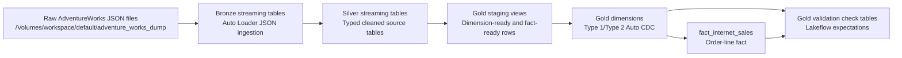

# AdventureWorks Dimensional Model Technical Design

## Purpose

This project implements an AdventureWorks dimensional warehouse on Databricks
using Lakeflow Spark Declarative Pipelines. It follows the dimensional modeling
use case described in the Databricks SQL dimensional warehouse blog series, with
the implementation adapted to declarative pipelines and Auto CDC.

The pipeline builds:

- A bronze ingestion layer from raw AdventureWorks JSON extracts.
- A silver layer with typed, cleaned source-aligned tables and data quality
  expectations.
- A gold dimensional model with date, customer, product, promotion, currency,
  and sales territory dimensions plus the Internet Sales fact table.
- Pipeline-native validation tables and manual SQL validation checks.

## Repository Layout

```text
.
├── databricks.yml
├── resources/
│   ├── catalogs.yml
│   └── pipelines.yml
├── src/adventure_works_etl/
│   ├── explorations/
│   └── transformations/
│       ├── bronze.py
│       ├── silver.py
│       ├── gold.py
│       └── helpers.py
└── docs/
    ├── dimensional_model_implementation_tasks.md
    ├── dimensional_model_validation.md
    ├── target_dimensional_model.png
    └── technical_design.md
```

## Deployment Model

The project is deployed as a Databricks Asset Bundle named
`adventure_works_dw`.

The primary pipeline resource is `adventure_works_etl`, defined in
`resources/pipelines.yml`.

Key pipeline settings:

- `serverless: true`
- `root_path: ../src/adventure_works_etl`
- Transformation discovery via `../src/adventure_works_etl/transformations/**`
- Event log table: `adventure_works_etl_event_log`
- Dev catalog: `adventure_works_dw`
- Dev schema: current user short name
- Dev event-log schema: `dev_${workspace.current_user.short_name}_logs`

The project working agreement expects the Databricks CLI profile `personal`.

## Data Flow



## Bronze Layer

The bronze layer is implemented in `src/adventure_works_etl/transformations/bronze.py`.

It ingests raw JSON files from:

```text
/Volumes/workspace/default/adventure_works_dump
```

The ingestion factory creates one streaming table per source table:

- `bronze_sales_salesorderheader`
- `bronze_sales_salesorderdetail`
- `bronze_sales_specialoffer`
- `bronze_sales_specialofferproduct`
- `bronze_sales_currencyrate`
- `bronze_sales_salesterritory`
- `bronze_production_product`
- `bronze_production_productsubcategory`
- `bronze_production_productcategory`
- `bronze_person_person`
- `bronze_person_emailaddress`
- `bronze_person_address`
- `bronze_person_stateprovince`
- `bronze_person_countryregion`
- `bronze_sales_customer`

Each table is loaded with Auto Loader:

- Format: JSON
- Inferred column types
- Source lineage column: `__source_file_name`
- Ingestion timestamp column: `__ingestion_time`

Bronze also creates count-verification views with `@dp.expect_or_fail` to
compare the raw JSON count to the target bronze table count.

## Silver Layer

The silver layer is implemented in `src/adventure_works_etl/transformations/silver.py`.

Silver tables are source-aligned cleaned tables. They perform:

- Column renaming from source naming conventions to snake case.
- Type casting for business keys, dates, timestamps, decimals, booleans, and
  numeric measures.
- Extraction of selected XML demographics fields from `Person.Person`.
- Spatial parsing for `Person.Address`.
- Row-level data quality expectations.
- Processing metadata with `__processing_time`.

Silver intentionally does not deduplicate source records. Downstream validation
therefore compares facts to distinct source business grains, not raw silver row
counts.

The silver layer currently does not persist `record_hash` columns. The shared
hash helper remains because the gold layer uses it for deterministic dimension
keys.

## Shared Helpers

`src/adventure_works_etl/transformations/helpers.py` provides:

- `record_hash(*cols, namespace=None)` for deterministic SHA-256 hashes.
- `individual_survey_field(xml_col, field_name)` for XML field extraction.
- `parse_spatial_location(value)` for latitude and longitude extraction from
  encoded spatial values.

The hash helper supports both column names and Spark Column expressions. Gold
uses the optional `namespace` argument to avoid accidental key collisions across
dimensions.

## Gold Layer

The gold layer is implemented in `src/adventure_works_etl/transformations/gold.py`.

It contains:

- Dimension staging views.
- Final dimensions.
- Inferred-member handling.
- Fact staging and fact table.
- Gold validation check tables.

### Dimension Staging Views

The staging views prepare source rows for Lakeflow Auto CDC:

- `stg_dim_customer`
- `stg_dim_product`
- `stg_dim_promotion`
- `stg_dim_currency`
- `stg_dim_sales_territory`

Each staging view exposes:

- The source business key.
- A deterministic surrogate key generated with `record_hash`.
- Descriptive attributes.
- `modified_at` for source sequencing and versioning.
- Source metadata where available.
- `is_late_arriving` for SCD2 dimensions that support inferred members.

Promotion is Type 1 and does not infer missing members. Customer, product,
currency, and sales territory infer missing keys referenced by sales facts.

### Dimensions

`dim_date`

- Static date dimension generated from sales order header date ranges.
- Covers order, due, and ship dates with a one-year past and future buffer.
- Uses integer `yyyyMMdd` date keys.

`dim_promotion`

- Type 1 Auto CDC table.
- Business key: `special_offer_id`.
- Surrogate key: `promotion_key`.

`dim_product`

- Type 2 Auto CDC table.
- Business key: `product_id`.
- Surrogate key: `product_key`.
- Includes product, subcategory, and category attributes.

`dim_currency`

- Type 2 Auto CDC table.
- Business key: `currency_rate_id`.
- Surrogate key: `currency_key`.
- Uses inferred `currency_rate_id = -1` for base-currency sales where the source
  order header has no currency rate.

`dim_sales_territory`

- Type 2 Auto CDC table.
- Business key: `territory_id`.
- Surrogate key: `sales_territory_key`.

`dim_customer`

- Type 2 Auto CDC table.
- Business key: `customer_id`.
- Surrogate key: `customer_key`.
- Enriches customer with person, email, address, state/province, and country
  attributes.
- Uses the latest observed order ship-to address per customer as the customer
  address source.

For Type 2 dimensions, Auto CDC maintains Lakeflow SCD metadata columns such as
`__START_AT` and `__END_AT`.

### Inferred Members

The gold staging views create inferred rows for missing SCD2 business keys
referenced by sales facts:

- Customer IDs from `silver_sales_order_header`
- Product IDs from `silver_sales_order_detail`
- Currency rate IDs from `silver_sales_order_header`
- Territory IDs from `silver_sales_order_header`

Inferred rows:

- Have deterministic surrogate keys.
- Use minimal null descriptive attributes.
- Set `is_late_arriving = true`.
- Use `1900-01-01 00:00:00` as the inferred `modified_at`.

When the real source row arrives later, Auto CDC can reconcile the dimension
history through the same staging flow.

### Fact Table

`fact_internet_sales` is the Internet Sales fact table at order-line grain:

```text
sales_order_id + sales_order_detail_id
```

It is maintained with Auto CDC Type 1 semantics from `stg_fact_internet_sales`.

Source tables:

- `silver_sales_order_detail`
- `silver_sales_order_header`

The fact filters to online orders with `header.online_order_flag`.

Foreign keys:

- `product_key`
- `customer_key`
- `promotion_key`
- `currency_key`
- `sales_territory_key`
- `order_date_key`
- `due_date_key`
- `ship_date_key`

SCD2 dimension keys are resolved using the order date and dimension effective
intervals. The first SCD2 version for each business key is treated as valid from
the beginning of time so historical facts can resolve when the first known
dimension version starts after the fact order date.

Measures:

- `order_quantity`
- `unit_price`
- `sales_amount`
- `sales_amount_before_discount`
- `discount_amount`

Degenerate dimensions:

- `sales_order_number`
- `sales_order_id`
- `sales_order_detail_id`

## Data Quality

### Silver Expectations

Silver expectations validate source-aligned table quality, including:

- Non-null business keys.
- Non-null `modified_at`.
- Valid numeric ranges.
- Valid date orderings.
- Spatial parsing and coordinate ranges for addresses.

Most silver expectations use `@dp.expect_all_or_drop`.

### Gold Staging Expectations

Gold staging expectations validate:

- Non-null dimension business keys.
- Non-null deterministic surrogate keys.
- Non-null `modified_at`.
- Required fact grain keys.
- Required fact foreign keys.
- Positive quantities and non-negative monetary values.

### Gold Uniqueness Check Tables

The pipeline materializes gold uniqueness check tables. Each table groups by the
expected unique key and emits `record_count`. A row-level expectation fails the
pipeline if any grouped key has `record_count <> 1`.

Current check tables:

- `gold_dim_date_date_key_uniqueness_check`
- `gold_dim_promotion_special_offer_id_uniqueness_check`
- `gold_dim_product_current_product_id_uniqueness_check`
- `gold_dim_currency_current_currency_rate_id_uniqueness_check`
- `gold_dim_sales_territory_current_territory_id_uniqueness_check`
- `gold_dim_customer_current_customer_id_uniqueness_check`
- `gold_fact_internet_sales_grain_uniqueness_check`

## Validation

Manual and CI-oriented validation SQL lives in:

```text
docs/dimensional_model_validation.md
```

The validation checks cover:

- Gold uniqueness expectation tables.
- Dimension current-row uniqueness.
- SCD2 interval overlap.
- Fact grain uniqueness.
- Fact-to-dimension resolution.
- Measure reconciliation.
- Source-to-fact grain count reconciliation.

Because silver is not deduplicated, the fact row-count validation compares the
fact table to distinct online source order-line grains rather than raw silver
row counts.

## Running The Project

Validate the bundle:

```bash
databricks bundle validate -t dev --profile personal
```

Deploy the bundle:

```bash
databricks bundle deploy -t dev --profile personal
```

Run the pipeline:

```bash
databricks bundle run adventure_works_etl -t dev --profile personal
```

Run local lint checks:

```bash
uv run ruff check src/adventure_works_etl/transformations
```

## Current Verified State

The latest end-to-end verification run completed successfully in the dev
workspace:

- Pipeline update: `22ba0e3c-aa4d-4231-baa9-df7c8b724665`
- Source distinct Internet Sales grains: `60398`
- Fact rows: `60398`
- Grain count delta: `0`
- Fact measure reconciliation deltas: `0`
- Fact-to-dimension unresolved keys: `0`
- SCD2 interval overlaps: `0`

These results are operational notes from the latest dev run, not hard-coded
pipeline assumptions.

## Design Notes And Tradeoffs

- The implementation uses Lakeflow Auto CDC from snapshot flows for dimensions
  and the fact table rather than hand-written merge logic.
- Surrogate keys are deterministic SHA-256 strings instead of integer identity
  keys. This makes reruns stable and avoids dependency on generated identities.
- SCD2 Auto CDC merge keys are source business keys, not surrogate keys. The
  surrogate key identifies a dimension version for fact joins; the business key
  identifies the entity whose history Auto CDC maintains.
- Gold staging views perform inferred-member creation so fact loading does not
  fail when a referenced SCD2 dimension member is missing.
- Silver remains source-aligned and intentionally does not deduplicate records.
  Dedup-sensitive validation uses distinct business grains or deterministic row
  selection.
- Promotion is modeled as Type 1 because the target star schema treats promotion
  attributes as overwrite-in-place values.
